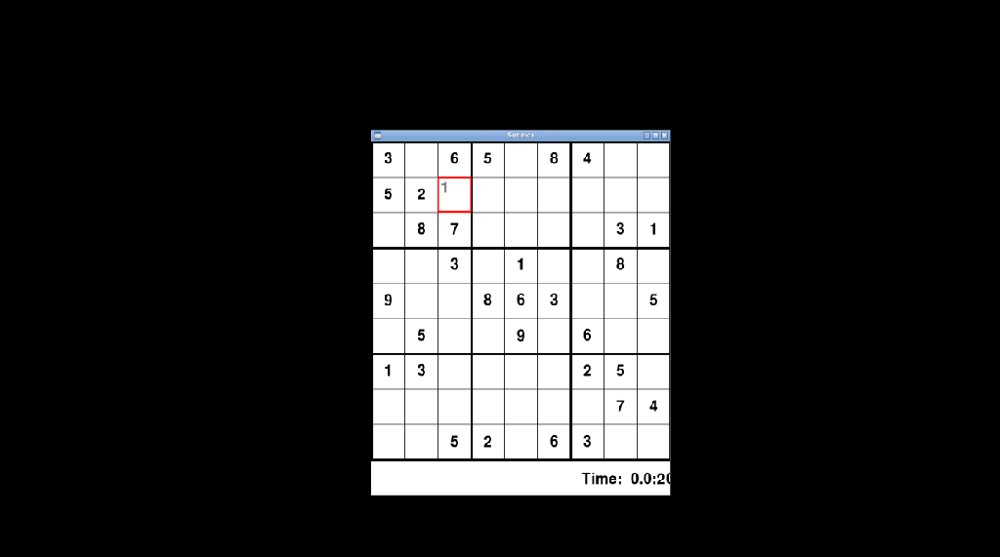
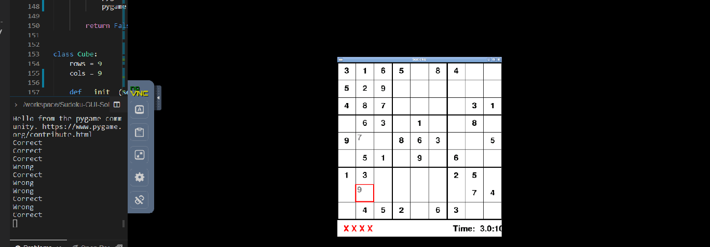

# GUI Sudoku Solver in Python

This is a project to Solve a Sudoku board in Python using the Backtracking Algorithm. the file sudoku.py is the Cli version, while the GUI.py is the GUI version of the same.

---

# How to play the game?

Enter the numbers from your keyboard and press Enter to confirm your selection such that each row, column and smaller grid has all numbers 1-9 only once. A wrong input gets a strike and a correct input is confirmed. Press the Delete key to delete or clear any Unconfirmed inputs.

---
# Screenshots

